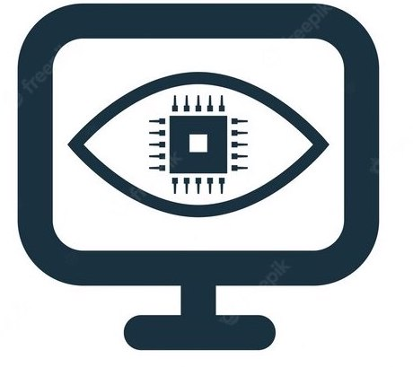

<h1> Welcome to My chanel.</h1>
  
 <h4> Hi I'm Print! </h4>  
I'm Vasu. Thakaew, Programmer from  <b>Nonthaburi, Thailand</b>, My interested about  Deep learning and  Computer Vision. Now i study <b>Master degree in Deep learning and Robotics filed</b>. 
 

<!--📏LINE-->

 #### :mailbox: Contract me! 
   
 

<!--📏LINE-->

### About me

- 🔭 I’m currently working My Master degree project about Multi Activity recognition and Palm oil Classification machine.
- :computer: Interest computer vision, deep learning, Big data, Machine learning, Data science
- 🤔 I spend all most time to practice programming skill.
- 📫 How to reach me: print1431@gmail.com
- ⚡ Fun fact: I will go to the GYM very often.
- :paperclip: [My Resume/CV(Old.)](https://github.com/ipenywis/ipenywis/blob/master/resumes/resume%20v1.0.pdf)

<!--📏LINE-->

<h3>My Ability skill</h3> 

             <image alt="Pytorch" src="https://img.shields.io/badge/PyTorch-%23EE4C2C.svg?style=for-the-badge&logo=PyTorch&logoColor=white"> <image alt="Pandas" src = "https://img.shields.io/badge/pandas-%23150458.svg?style=for-the-badge&logo=pandas&logoColor=white" />                           

#### Github Stats

 
  

<!--📏LINE-->

### My listening

<!--📏LINE-->

<!--🐍📈SNAKEGRAPH / 🌐WEBSITE: https://github.com/Platane/snk -->

<!--🐱CAT-->

